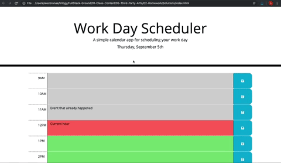

# 05-Day-Planner: Third-Party APIs - Work Day Scheduler

The following animation demonstrates the application functionality:




## Libraries/APIs Used

Moment - in order to retreive current time 
[Moment.js](https://momentjs.com/)

JQuery Cookie Tracker - Javascript library for accessing and manipulating HTTP cookies in the web browser
[Jaaulde-cookies.js](https://github.com/JAAulde/cookies/blob/master/lib/jaaulde-cookies.js)


## The Task At Hand

Create a simple calendar application that allows the user to save events for each hour of the day. This app will run in the browser and feature dynamically updated HTML and CSS powered by jQuery.


## User Story

```
AS AN employee with a busy schedule
I WANT to add important events to a daily planner
SO THAT I can manage my time effectively
```

## Acceptance Criteria

```
GIVEN I am using a daily planner to create a schedule
WHEN I open the planner
THEN the current day is displayed at the top of the calendar
```
             ```
                // Displaying the time using moment.js 
                var currentDayValue = moment().format("dddd, MMMM Do YYYY");
                console.log(currentDayValue);

                // grabbed the element that we want to append to the <header> 
                var jumbotronEl = document.querySelector(".jumbotron");

                // create the element
                var pEl = document.createElement("p");

                pEl.innerText = (moment().format("dddd, MMMM Do YYYY"));

                // append to class jumbotron 

                jumbotronEl.appendChild(pEl);
            ```
             

```
WHEN I scroll down
THEN I am presented with timeblocks for standard business hours
WHEN I view the timeblocks for that day
THEN each timeblock is color coded to indicate whether it is in the past, present, or future
```

            ```
                var currentHour = moment().format('LT')[0];

                function getArrays(currentHour){
                    var past = []
                    var future = []
                    if (currentHour <= 5 && currentHour >= 1){ // if currentHour in between (inclusive) 1 and 5
                        for(i = 8; i <= 12; i++){ // that means 9 - 12 in the past
                        past.push(i);
                        }
                        for(j = 1; j <= 5; j++) {
                        if(j < currentHour) { // loop through and check the rest
                            past.push(j);
                        } else if (j > currentHour) {
                            future.push(j);
                        }
                        }
                    }

                    if (currentHour <= 12 && currentHour >= 9) { //if currentHour in between (inclusive) 9 and 12
                        for(i = 1; i <= 5; i++){  // that means  1- 5 in the future
                        future.push(i);
                        }
                        for(j = 8; j <= 12; j++) { // check the rest
                        if(j < currentHour) {
                            past.push(j);
                        } else if (j > currentHour) {
                            future.push(j);
                        }
                        }
                    }
                    return [past, future];
                }
                var past;
                var future;
                past = getArrays(3)[0];
                future = getArrays(3)[1]
                console.log("past: ", past, "future: ", future, "current hour = 3")


                past = getArrays(10)[0];
                future = getArrays(10)[1]
                console.log("past: ", past, "future: ", future, "current hour = 10")
            ```
            

notes: Spent over 10 hours on this section and this is the logic that makes sense to me. Now I need to connect it with my indvidual IDs. 

```
WHEN I click into a timeblock
THEN I can enter an event
WHEN I click the save button for that timeblock
THEN the text for that event is saved in local storage
WHEN I refresh the page
THEN the saved events persist
```
            ```
                $('.btn').on('click', function() {
                
                    $('input[type="text"]').each(function(){ 
                        
                        var className = $(this).attr('class');
                        var value = $(this).val();
                        if (localStorage){
                            localStorage.setItem(className, value);
                            console.log(className);  
                            console.log(value);
                        } else {
                            $.cookies.set(className, value);
                            return $.cookies.get(className);
                        } 
                    });   
                });
            ```


    
notes: Still working on this section. I'm able to see it in my log, but it doesn't work when I refresh


## Review

You are required to submit the following for review:

* The URL of the deployed application - https://avaarm.github.io/05-Day-Planner/

* The URL of the GitHub repository - https://github.com/avaarm/05-Day-Planner

